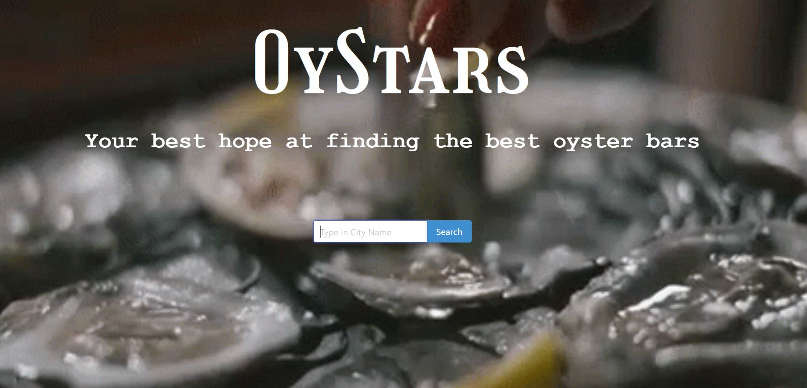
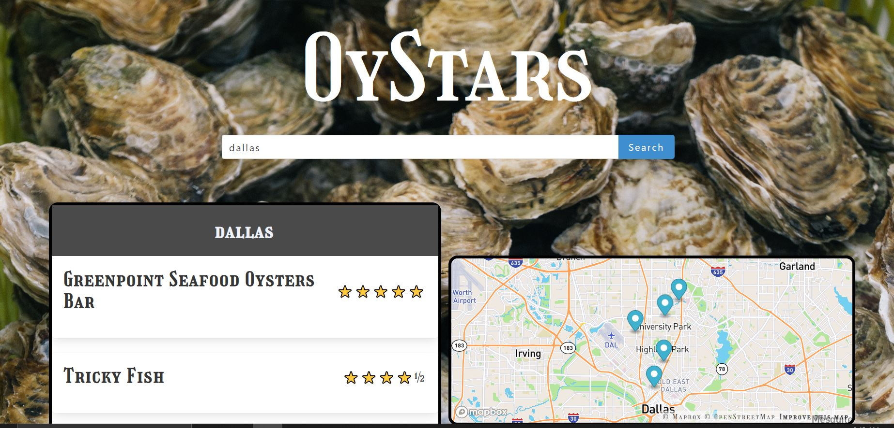

# Oystars

## Description

This app was created for oyster enthusiasts, to be able to search for high rating oyster bars/restuarants and know where they are located.

## Usage
To open site, click on the link below.\
https://spencox.github.io/OyStars/

It will then direct you to the main page (screenshot below)
To use type the city name you would like to look for and click on the search button.

Then it will take you to the search page where it will desplay a list of options with their current yelp star rating. 
A map of the city with pin locations will be displayed next to the list.

## Credits
References:\
https://docs.developer.yelp.com/reference/v3_business_search\
https://developer.mozilla.org/en-US/docs/Web/JavaScript/Reference/Global_Objects/encodeURIComponent\
https://stackoverflow.com/questions/53357891/how-do-i-resolve-the-cors-error-in-yelp-api-call\
https://www.scaler.com/topics/javascript-sort-an-array-of-objects/\

API:\
https://fusion.yelp.com/\
https://docs.mapbox.com/api/maps/

CSS Framework:\
https://bulma.io/documentation/overview/\

## Contributors
Spencer Cox\
Marcos Jorge\
Angelica Montoya

